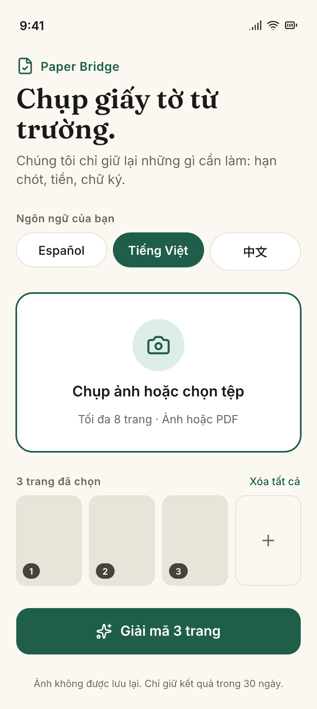
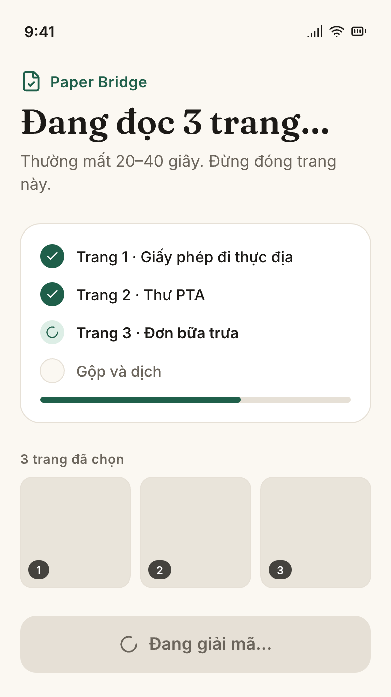
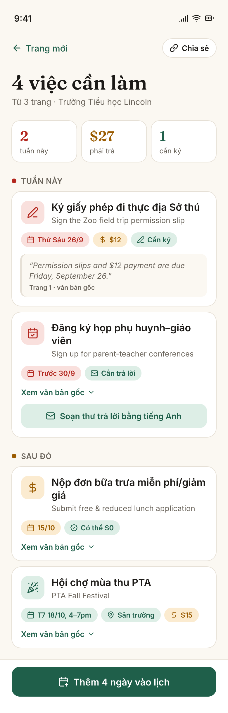
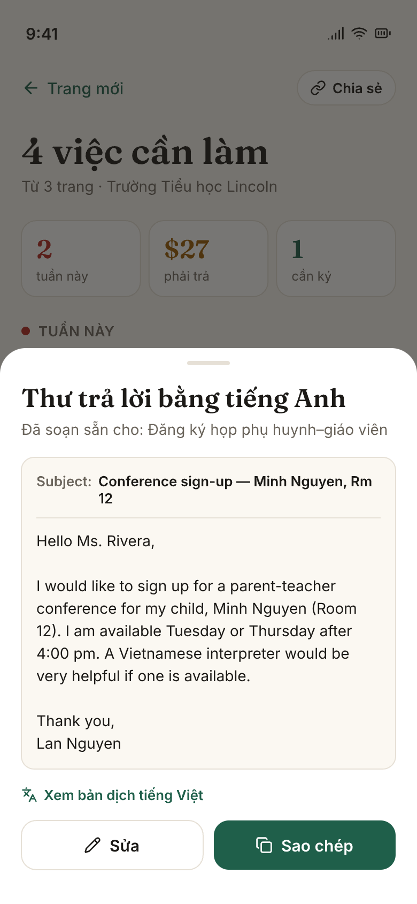

# Paper Bridge

**The school sent home 12 pages. Only 4 sentences mattered.**

Paper Bridge reads the stack of paperwork your kid brought home, pulls out only what needs *doing* — due dates, fees, signatures, RSVPs — in your language, and drops the dates straight onto your phone calendar. Built at [SASEhack 2026](https://stemconnect.events).

<p align="center">
  
  
  
  
</p>

## Why

Whole-document translators hand an immigrant parent twelve pages in Spanish. What they actually needed was the four lines that would have cost them something if missed: *permission slip and $12 due Friday*, *reply by the 30th to get a conference slot*, *free-lunch application due Oct 15*. Paper Bridge finds those lines, translates them, and shows the exact English sentence each one came from — so a bilingual cousin or the teacher can check its work in one glance.

## What it does

1. **Photograph** up to 8 pages — flyers, forms, newsletters. Blurry is fine.
2. **Extract** only the action items: deadlines, money, signatures, replies. Everything else is dropped.
3. **Translate** into English, Español, Tiếng Việt or 中文, keeping the English source quote.
4. **Calendar** — one tap downloads an `.ics` with every date; payments and signatures get a reminder two days early.
5. **Reply** — for anything that needs an answer, a polite English email is already drafted. Edit, copy, send.

Results live at a private link for 30 days. Photos are never stored. No account needed (Google sign-in is optional, for a history of past stacks).

## Stack

| | |
|---|---|
| Frontend | Next.js 16 · TypeScript · Tailwind v4 · shadcn/ui · next-intl · Firebase Auth + Firestore (optional history) — deployed on Vercel |
| Backend | FastAPI · Pydantic v2 · `google-genai` (Gemini vision + structured output) · `icalendar` — deployed on Railway |
| Storage | Cloudflare KV, result JSON only, 30-day TTL |
| Design | [Pencil](https://pen.dev) — source in `paper-bridge.pen`, exports in [`design/`](design/README.md) |

The one non-deterministic step (Gemini) lives in a single file, `server/app/decoder.py`. Every screen is a pure function of the `DecodeResult` it returns; urgency is computed in code, never asked of the model.

## Run it locally

Package managers are `uv` (server) and `bun` (client).

```bash
# server
cd server
cp .env.example .env          # GEMINI_API_KEY, Cloudflare KV, ALLOWED_ORIGIN
uv sync
uv run --env-file .env uvicorn app.main:app --reload --port 8000

# client
cd client
cp .env.example .env.local    # NEXT_PUBLIC_API_URL=http://localhost:8000 (+ Firebase keys, optional)
bun install
bun dev
```

Open http://localhost:3000, pick a language, and upload something from [`docs/examples/`](docs/examples/README.md) — seven realistic school papers in four languages, with a table of what each should extract.

Tests: `uv run pytest` in `server/`, `bun test` in `client/`.

## Repo map

```
server/   FastAPI — /decode, /r/{id}, /r/{id}/calendar.ics
client/   Next.js — /[locale], /[locale]/r/[id], /about, /sample, /signin, /history
docs/     spec, implementation plan, example papers
design/   Pencil mockups + PNG exports
AGENTS.md rules for humans and AI agents working here
```

Design doc: [`docs/superpowers/specs/2026-09-19-paper-bridge-design.md`](docs/superpowers/specs/2026-09-19-paper-bridge-design.md) · Plan: [`docs/superpowers/plans/2026-09-19-paper-bridge.md`](docs/superpowers/plans/2026-09-19-paper-bridge.md)

## Team

[@jacklvd](https://github.com/jacklvd) · [@SonnySideUp37](https://github.com/SonnySideUp37) — built in ~36 hours at SASEhack 2026.

## License

[MIT](LICENSE)
