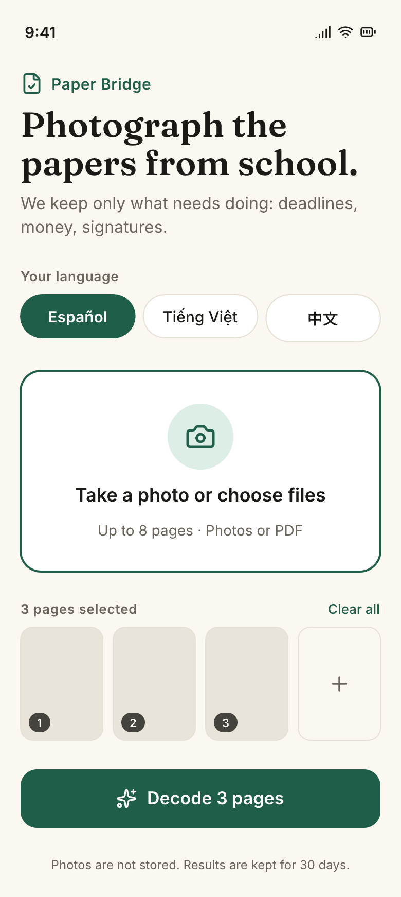
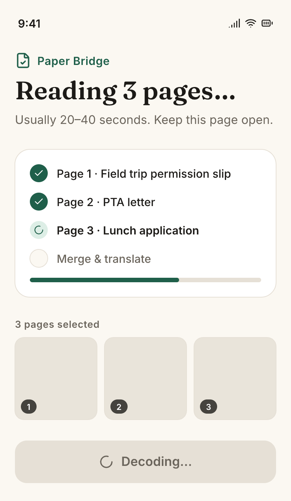
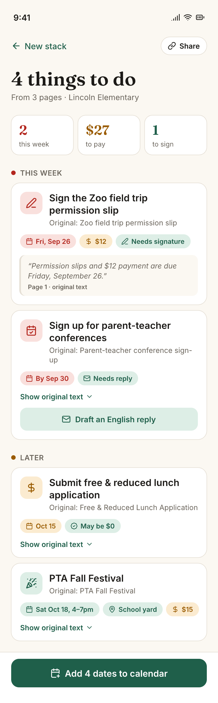
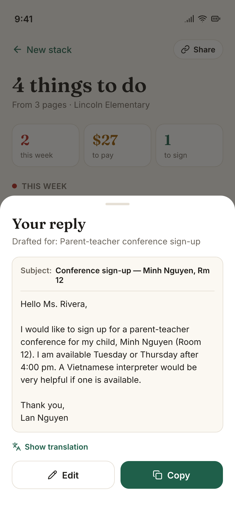
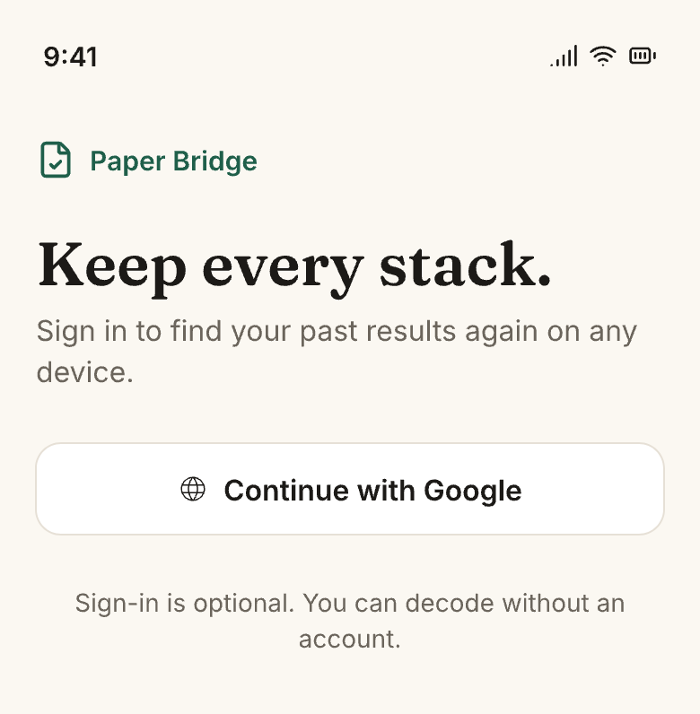
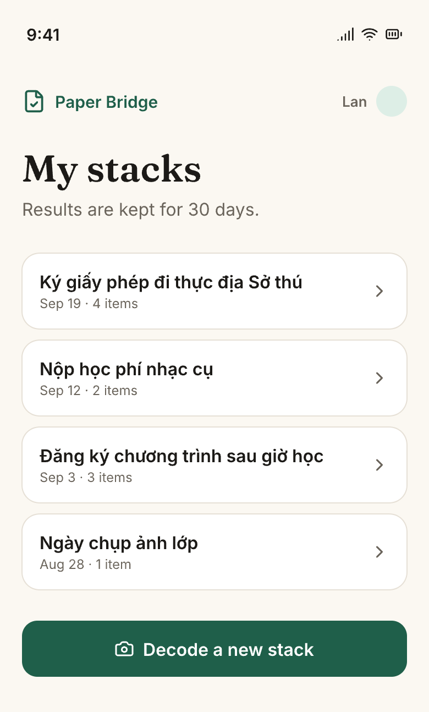
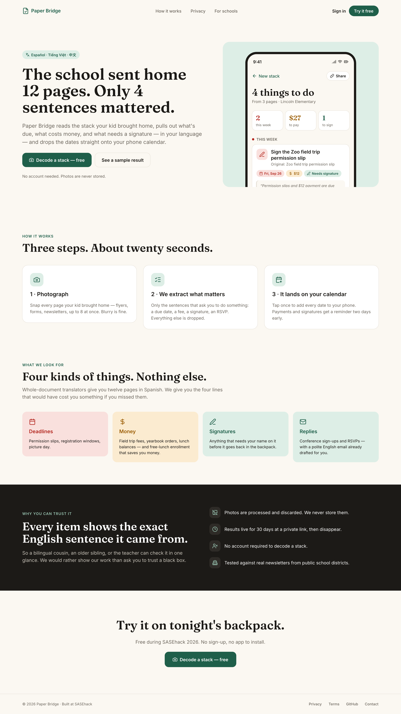

# Design

Source: [`../paper-bridge.pen`](../paper-bridge.pen) (repo root) — open with [pen.dev](https://pen.dev). PNG exports in `screens/` (2x).

Tokens: bg `#FBF8F2` · ink `#1C1A17` · muted `#6B655C` · line `#E6E0D6` · accent `#1F5F4A` · accent-soft `#DDEEE6` · danger `#B3261E` / `#F9E0DD` · warn `#9A5B00` / `#FBEBD0`. Headings **Fraunces 600**, body **Inter**.

| Screen | VI | EN |
|---|---|---|
| Upload |  |  |
| Decoding |  |  |
| Results |  |  |
| Reply draft |  |  |
| Sign in | |  |
| History | |  |

About page (web):

